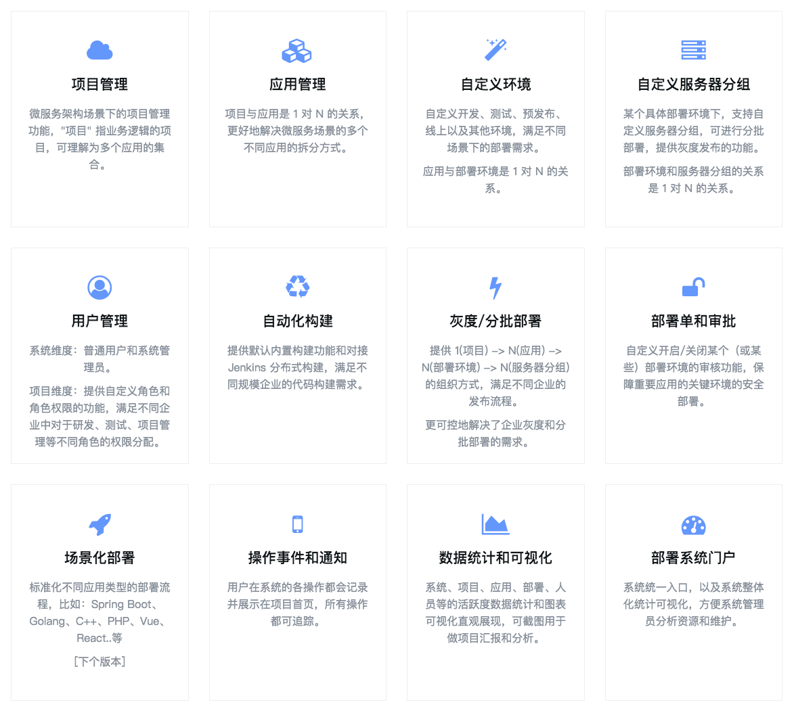
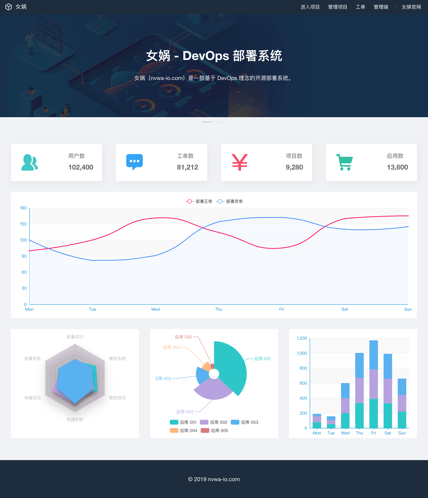
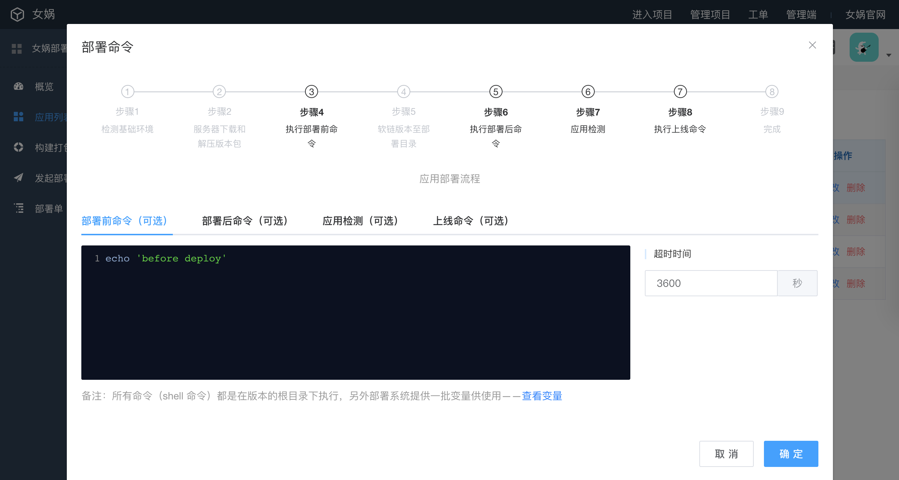
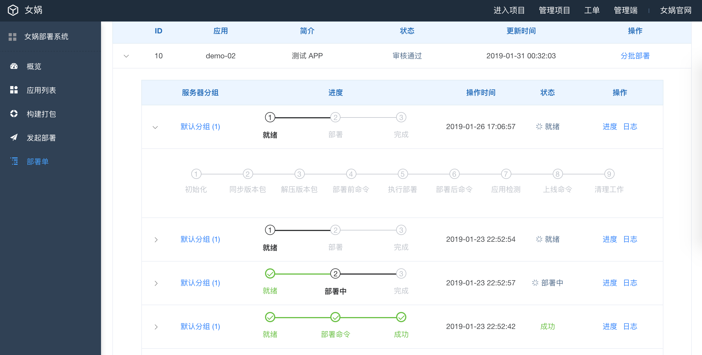

# 女娲 - 开源 DevOps CI/CD 自动构建和自动部署系统

*备注：当前版本功能还未完全开发完，可以先不用测试。*

### 女娲架构抽象

### 女娲特性

### 女娲首页

### 应用部署配置

### 应用分布部署

更多特性截图，见女娲官网: [nvwa-io.com](http://nvwa-io.com)

# 基础环境

初始化: /data/nvwa
依赖软件: ansible